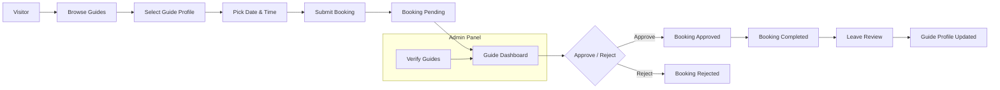

# 🌍 Guide Cai

A modern **guide marketplace** connecting travelers with verified local guides for authentic, personalized experiences worldwide.

Travelers can explore guides, check availability, book by the hour, and leave reviews — while guides manage their bookings and availability through a personal dashboard.

---

## ✨ Features

### 🔎 For Travelers

- **Discover Local Guides**: Browse verified guides with detailed profiles, expertise, and reviews
- **Smart Search & Filters**: Find guides by location, language, specialties, ratings, and availability
- **Guide Profiles**: View bio, reviews, hourly rates, availability calendar, and completed bookings
- **Booking System**:
    - Select date, time, and total hours
    - Prevents duplicate bookings
    - Appears in user dashboard as _pending_

- **Reviews & Ratings**: Leave feedback after completed bookings

### 🧭 For Guides

- **Guide Registration**: Apply with details and KYC documents
- **Admin Approval & Verification**: Only verified guides are listed for travelers
- **Dashboard**: Manage availability calendar, booking requests, and profile info
- **Booking Flow**: Accept or cancel pending bookings, mark completed when finished

### 🛠️ For Admins

- **Admin Panel**: Manage all users (visitors, guides, admins)
- **Guide Verification**: Approve KYC and mark guides as verified
- **System Control**: Oversee bookings, reviews, and platform activity

---

## 🚀 Coming Soon

- **Tour Packages by Guides**: Custom tours curated and managed by guides

---

## 🛠️ Tech Stack

- **Frontend**: React 18 + TypeScript (via Inertia.js)
- **Backend**: Laravel 12
- **Build Tool**: Vite
- **Styling**: Tailwind CSS
- **UI Components**: shadcn/ui + Radix UI
- **Icons**: Lucide React
- **Routing**: Inertia + Laravel routing
- **Database**: MySQL/Postgres (configurable)

---

## 📦 Installation

### Prerequisites

- Node.js (v16+)
- npm or yarn
- Composer
- PHP 8+
- MySQL/Postgres

### Steps

1. Clone the repository:

```bash
git clone <repo-url>
cd guide-cai
```

2. Install dependencies:

```bash
npm install
composer install
```

3. Configure `.env`:

```bash
cp .env.example .env
php artisan key:generate
```

4. Run migrations and seeders:

```bash
php artisan migrate --seed
```

5. Start development servers:

```bash
npm run dev
php artisan serve
```

6. Open your browser at:

```
http://localhost:8000
```

---

## 👥 User Roles

- **Visitor** → Browse guides, book experiences, leave reviews
- **Guide** → Register, verify, manage availability & bookings
- **Admin** → Approve guides, manage users, oversee bookings

---

## 📅 Booking Flow

1. Traveler selects a guide profile
2. Picks a date/time from the **availability calendar**
3. Submits booking request → marked as _pending_
4. Guide reviews and approves/rejects request
5. After completion, guide marks as _done_
6. Traveler leaves review & rating

### 🔄 Booking Lifecycle Diagram


